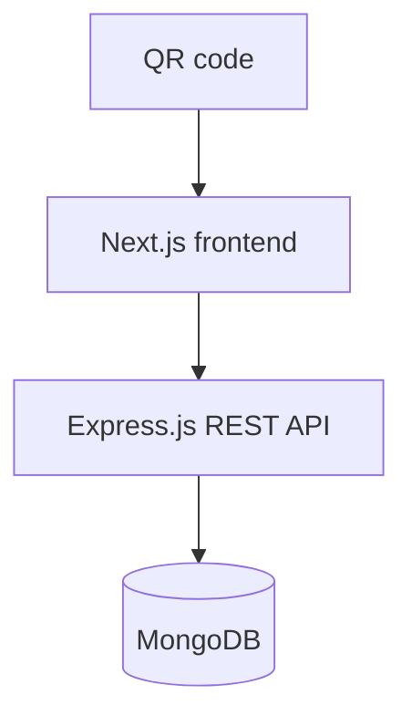
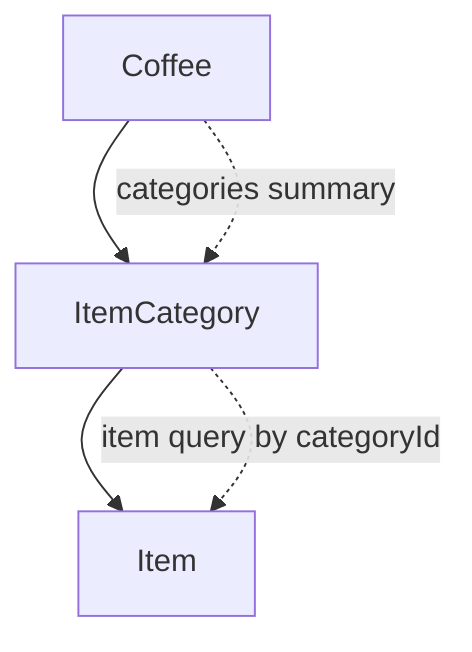
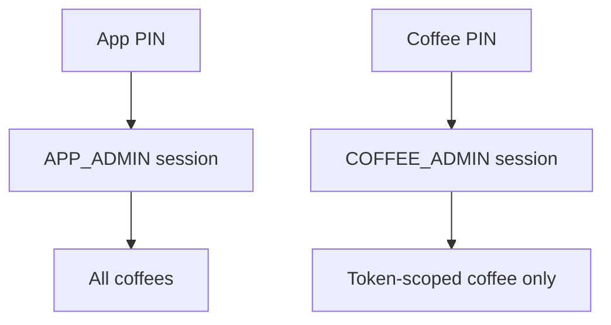

# MENU SCAN Frontend

MENU SCAN is a mobile-first digital menu for coffee shops. A QR code opens a
coffee-specific URL, where guests discover categories and menu items without
installing an app. The frontend is a Next.js App Router application that
renders the public menu, provides the two PIN-protected backoffice
experiences, and communicates with the MENU SCAN Express.js + MongoDB backend.

The production site uses `/menuscan` as its canonical namespace. Older
bare-root links remain supported through permanent redirects.

## Project overview

### Public experience

```text
QR code
   |
   v
/menuscan/:slug
   |
   v
Coffee
   |
   v
Organic category bubbles
   |
   v
/menuscan/:slug/:categName
   |
   v
Item cards
```

The coffee slug identifies the tenant. The frontend requests the coffee and
its categories from the API, then requests category items only when the
category page is opened. Coffee names, categories, and items are never
hardcoded into the UI.

### Backoffice

```text
/menuscan/admin
   |
   v
Application admin

/menuscan/:slug/admin
   |
   v
Coffee admin
```

Application administrators manage every coffee. A coffee administrator manages
only the coffee associated with their authenticated session.



## Technology stack

| Area | Actual implementation |
| --- | --- |
| Framework | Next.js `16.3.5`, App Router, React Server Components, Turbopack in development |
| UI runtime | React `19.3.0` and `react-dom` `19.3.0` |
| Language | TypeScript `^5.8.0`, strict mode |
| Styling | Plain global CSS in `src/app/globals.css`; no Tailwind or CSS framework |
| Fonts | `next/font/google` with Fraunces for display text and Inter for body text |
| Data fetching | Native `fetch`, wrapped by `src/lib/api.ts`; no React Query/SWR |
| Forms | Controlled React components with local validation; no form library |
| Validation | Local URL and price validators in `src/lib/validators.ts`, with backend validation remaining authoritative |
| UI component library | None; components are local to `src/components` |
| Images | `next/image` with `unoptimized: true`; arbitrary remote URLs are accepted |
| Authentication | Short-lived backend bearer token stored in browser `sessionStorage` |
| Localization | Typed French dictionary in `src/i18n/fr.ts`; locale `fr-TN` |

The only runtime dependencies are Next.js, React, and React DOM. There is no
client state-management package, API client package, CSS framework, or schema
validation package.

## Project structure

```text
frontend/
├── public/
│   ├── icon.svg
│   ├── icon-192.png
│   ├── icon-512.png
│   └── manifest.webmanifest
├── src/
│   ├── app/
│   │   ├── page.tsx                         # Redirects / -> /menuscan
│   │   ├── layout.tsx                       # Root layout, fonts, metadata, public chrome
│   │   ├── globals.css                      # Shared public and admin design system
│   │   ├── error.tsx                        # Branded runtime error boundary
│   │   ├── not-found.tsx                    # Branded global 404
│   │   ├── [coffeeSlug]/page.tsx            # Legacy public coffee redirect
│   │   ├── [coffeeSlug]/admin/page.tsx      # Legacy coffee-admin redirect
│   │   └── menuscan/
│   │       ├── page.tsx                     # Canonical brand landing page
│   │       ├── admin/page.tsx               # Application-admin route
│   │       └── [slug]/
│   │           ├── page.tsx                 # Public coffee menu
│   │           ├── admin/page.tsx           # Coffee-admin route
│   │           └── [categName]/
│   │               ├── page.tsx             # Public category items page
│   │               └── not-found.tsx       # Category-specific 404
│   ├── components/
│   │   ├── admin/                           # PIN gate, CRUD forms/lists, admin shell
│   │   ├── layout/                          # Header, footer, public chrome, back-to-top
│   │   └── menu/                            # Brand intro, bubbles, item cards and art
│   ├── config/
│   │   ├── api.ts                            # Context-aware API base URL
│   │   └── site.ts                           # Brand, locale, currency and public URL
│   ├── i18n/
│   │   ├── dictionary.ts                     # Dictionary TypeScript contract
│   │   ├── fr.ts                             # French UI copy
│   │   └── index.ts                          # Dictionary access
│   ├── lib/
│   │   ├── api.ts                            # Public and admin API functions
│   │   ├── adapters.ts                       # Backend DTO -> presentation model
│   │   ├── admin-errors.ts                   # Status -> user-facing admin errors
│   │   ├── admin-session.ts                   # sessionStorage token lifecycle
│   │   ├── blob.ts                            # Deterministic bubble geometry/layout
│   │   ├── menu.ts                            # Currency/price formatting
│   │   ├── public-coffee.ts                  # Public coffee resolution and 404 mapping
│   │   ├── utils.ts                           # Slugs and class-name helpers
│   │   └── validators.ts                     # URL and price validation
│   └── types/
│       ├── backend.ts                        # API envelopes and backend DTOs
│       └── menu.ts                           # UI presentation types
├── .env.example
├── next.config.ts
├── package.json
└── tsconfig.json
```

`src/app` owns route composition and server-side data loading. `src/components`
contains reusable UI. `src/lib/api.ts` is the only frontend API boundary;
components should call its typed functions rather than constructing URLs
directly. Backend DTOs belong in `src/types/backend.ts`; display-only derived
fields belong in `src/types/menu.ts` and `src/lib/adapters.ts`.

## Routing architecture

| Route | Implementation | Data/access |
| --- | --- | --- |
| `/` | `src/app/page.tsx` | Permanent redirect to `/menuscan` |
| `/menuscan` | `src/app/menuscan/page.tsx` | Public brand landing; no backend data |
| `/:coffeeSlug` | `src/app/[coffeeSlug]/page.tsx` | Permanent redirect to `/menuscan/:coffeeSlug` |
| `/menuscan/:slug` | `src/app/menuscan/[slug]/page.tsx` | Server-fetches a coffee and its category summaries by slug |
| `/menuscan/:slug/:categName` | `src/app/menuscan/[slug]/[categName]/page.tsx` | Resolves category within that coffee, then fetches category items |
| `/menuscan/admin` | `src/app/menuscan/admin/page.tsx` | Client-driven application-admin PIN gate and console |
| `/menuscan/:slug/admin` | `src/app/menuscan/[slug]/admin/page.tsx` | Client-driven coffee-admin PIN gate and console |
| `/:coffeeSlug/admin` | `src/app/[coffeeSlug]/admin/page.tsx` | Permanent redirect to canonical coffee-admin route |

The category URL uses `slugify(category.name)`. It is not a backend category
ID in the public URL. The page first loads the coffee, finds a category whose
slugified name matches `categName`, and only then requests items using that
category's backend ID. This keeps category resolution scoped to the owning
coffee.

## Public menu flow

```text
QR code
    |
    v
Extract `slug` from `/menuscan/:slug`
    |
    v
GET /api/v1/coffees/:coffeeSlug
    |
    v
Render coffee name/logo and dynamic category bubbles
    |
    v
User opens `/menuscan/:slug/:categName`
    |
    v
Resolve category name within the coffee
    |
    v
GET /api/v1/categories/:categoryId/items
    |
    v
Render item cards or an empty-category state
```

`resolvePublicCoffee` converts backend `400` and `404` responses into the
branded Next.js not-found experience. Other failures reach the branded error
boundary instead of exposing backend details.

The public coffee page is server-rendered. Category links are real Next.js
links, so category pages are deep-linkable and refresh-safe. There is no
client-side menu database or fallback list of coffee/category/item records.

## Data architecture

The backend is the source of truth. The frontend mirrors its DTOs in
`src/types/backend.ts` and adapts them for visual components.



### Backend/API DTOs

| Type | Fields |
| --- | --- |
| `CoffeeDto` | `id`, `name`, `logo`, `cover: string \| null`, `slug`, `categories: CategoryDto[]` |
| `CategoryDto` | `id`, `name`, `image: string \| null` |
| `ItemDto` | `id`, `name`, `description: string \| null`, `price: number`, `image: string \| null` |
| `AdminCoffeeDto` | `id`, `name`, `logo`, `cover: string \| null`, `slug`, `categoryCount`, `createdAt`, `updatedAt` |
| `AdminCategoryDto` | `id`, `name`, `image: string \| null`, `createdAt`, `updatedAt` |
| `AdminItemDto` | `id`, `name`, `description`, `price`, `image`, `itemCategoryId`, timestamps |

All successful backend responses are expected to use
`{ success: true, data }`. Errors use `{ success: false, message, details? }`.

Prices are decimal JavaScript numbers, such as `2.5`, not integer minor units.
`formatPrice` renders TND with exactly three fraction digits using
`Intl.NumberFormat("fr-TN", { style: "currency", currency: "TND" })`.

Public presentation models are intentionally richer:

```ts
interface MenuCategory {
  id: string;
  name: string;
  icon?: string;
  accent: string;
  items: MenuItem[];
}

interface MenuItem {
  id: string;
  name: string;
  description: string;
  price: number;
  image?: string;
  accent?: string;
}
```

`toMenuCategory` derives a stable accent and fallback icon from the category
ID/name. When a category image exists, the public category bubble displays it.
Items are not embedded in the category adapter; they are fetched on demand.
`toMenuItem` converts nullable API description/image values to the UI shape.

When backend DTOs change, update `src/types/backend.ts`, the API function
signatures, and the adapters together. Do not invent frontend-only copies of
backend fields.

## API integration

### API origins

`src/config/api.ts` uses `BACKEND_API_URL` for server-rendered requests and
`NEXT_PUBLIC_BACKEND_API_URL` for browser requests. Both default to the local
Express API at `http://localhost:4000`.

Browser requests go directly to the Express backend. This is intentional:
multipart image uploads must not pass through a Next.js/Vercel proxy body limit.
The backend CORS configuration must allow the deployed frontend origin.

Every request uses `cache: "no-store"` and sends an `Accept: application/json`
header. JSON requests receive `Content-Type: application/json`; `FormData`
uploads leave the content type unset so the browser supplies the multipart
boundary.
Non-2xx responses and unsuccessful envelopes become `ApiClientError` instances
with the HTTP status attached.

### Public endpoints

| Method | Endpoint | Used by |
| --- | --- | --- |
| `GET` | `/api/v1/coffees/:coffeeSlug` | Public coffee and category pages |
| `GET` | `/api/v1/categories/:categoryId/items` | Public category page |

### Authentication endpoints

| Method | Endpoint | Result |
| --- | --- | --- |
| `POST` | `/api/v1/admin/auth/app` | App-admin bearer session |
| `POST` | `/api/v1/admin/auth/coffee/:coffeeSlug` | Coffee-admin bearer session |

### Application-admin endpoints

All endpoints below require `Authorization: Bearer <token>`.

| Method | Endpoint | Operation |
| --- | --- | --- |
| `GET` | `/api/v1/admin/coffees` | List coffees |
| `POST` | `/api/v1/admin/coffees` | Create coffee |
| `PATCH` | `/api/v1/admin/coffees/:coffeeId` | Edit coffee |
| `DELETE` | `/api/v1/admin/coffees/:coffeeId` | Delete coffee and cascade its categories/items |
| `PATCH` | `/api/v1/admin/coffees/:coffeeId/pin` | Reset a coffee PIN |

### Image uploads

| Method | Endpoint | Operation |
| --- | --- | --- |
| `POST` | `/api/v1/admin/images` | Upload one multipart image using the `file` field |
| `DELETE` | `/api/v1/admin/images/:imageId` | Delete an uploaded image |

The upload request uses the authenticated admin bearer token. The frontend
selects the file and sends it to Express; only the backend talks to Cloudflare
R2. The backend returns the public URL, which the subsequent coffee/item CRUD
request persists in MongoDB. The browser never receives R2 credentials.

### Coffee-admin endpoints

All endpoints below require the coffee-admin bearer token. The backend derives
the owned coffee from the token; the frontend does not send an arbitrary
coffee owner ID.

| Method | Endpoint | Operation |
| --- | --- | --- |
| `GET` | `/api/v1/admin/my-coffee` | Load the authenticated coffee |
| `PATCH` | `/api/v1/admin/my-coffee` | Edit coffee name, logo, cover, or slug |
| `PATCH` | `/api/v1/admin/my-coffee/pin` | Change current coffee PIN |
| `GET` | `/api/v1/admin/my-coffee/categories` | List owned categories |
| `POST` | `/api/v1/admin/my-coffee/categories` | Create category |
| `PATCH` | `/api/v1/admin/my-coffee/categories/:categoryId` | Edit category |
| `DELETE` | `/api/v1/admin/my-coffee/categories/:categoryId` | Delete category and cascade items |
| `GET` | `/api/v1/admin/my-coffee/categories/:categoryId/items` | List category items |
| `POST` | `/api/v1/admin/my-coffee/categories/:categoryId/items` | Create item |
| `PATCH` | `/api/v1/admin/my-coffee/items/:itemId` | Edit item, promotion, or availability |
| `DELETE` | `/api/v1/admin/my-coffee/items/:itemId` | Delete item |

## Category bubbles

`CategoryBubbles` receives category summaries from the backend and generates
one link per category. It does not contain a fixed list of categories.

For each category:

- `categoryAccent` hashes the backend category ID into a warm, stable palette.
- `categoryIcon` selects an emoji from name keywords, or a stable fallback.
- `bubbleGeometry` uses a seeded FNV-1a hash and `mulberry32` PRNG to derive
  border-radius values, a small tilt, and vertical drift.
- `layoutBubbleRows` greedily packs approximately three equal-weight bubbles
  per row (`CATEGORY_WEIGHT = 1`, `MAX_ROW_WEIGHT = 3.1`).
- `categoryHref` slugifies the display name and creates the canonical category
  URL.

The bubble field is a responsive flex layout. It is touch-friendly, keyboard
focusable, and uses hover/focus feedback without requiring JavaScript state.
An empty category collection renders a translated empty state. The selected
category is represented by the destination page rather than a persistent
client-side selection store.

## Item cards

`MenuItemCard` displays the item name, description, formatted price, and
visual art. `ItemArt` uses the optional remote `image` URL through
`next/image`; if the URL is absent or the image fails to load, it falls back
to a gradient block with the item's initial.

Cards use a single-column sheet on the mobile-first layout and a constrained
larger presentation at wider widths. Category pages show the item count in
their header. A category with zero items renders the translated
“nothing in this category” state instead of an empty list.

## Backoffice architecture

Both backoffice surfaces are client components because they manage PIN input,
session restoration, CRUD mutations, tabs, dialogs, and transient notices.

### Application admin: `/menuscan/admin`

`AppAdmin` accepts only an `APP_ADMIN` session. After authentication it:

- loads all coffees with `GET /admin/coffees`;
- creates coffees with name, logo, and optional cover image;
- edits name, logo, cover, and optionally slug;
- deletes a coffee after an explicit confirmation dialog;
- resets a coffee PIN through the reset endpoint after confirmation;
- links each coffee to its public menu.

New coffee slug generation is intentionally delegated to the backend. Edit-mode
slug input accepts lowercase letters, numbers, and hyphens.

### Coffee admin: `/menuscan/:slug/admin`

`CoffeeAdmin` accepts only a `COFFEE_ADMIN` session. It loads the token-scoped
coffee and verifies that its returned slug equals the route slug. A mismatch
shows a re-login message rather than rendering the wrong coffee.

The menu tab supports category and item CRUD. Categories support optional image
selection, local preview, backend upload, and replacement. Items are loaded lazily for the
selected category. The settings tab edits coffee name, logo, and slug. The

Coffee admins can edit each item's regular price, optional promotional price,
and availability. Promotional prices must be greater than zero and lower than
the regular price; clearing the field removes the promotion. Unavailable items
remain in the database and admin list, but the public menu marks them
`Indisponible` and does not present a promotional price as active. The settings tab edits coffee name, logo, and slug. The
security tab changes the coffee PIN. The top bar provides logout and a link to
the public menu.



## PIN gate and session handling

```text
Open admin route
      |
      v
Four-digit PIN screen
      |
      v
POST authentication endpoint
      |
      v
Backend verifies PIN and returns short-lived bearer token
      |
      v
Store validated session in sessionStorage
      |
      v
Render the appropriate admin console
```

`AdminPinGate` accepts digits only, limits input to four characters, and submits
only when exactly four digits are present. The returned token, role,
optional `coffeeId`, and `expiresIn` are stored under
`menuscan.admin.session` in `sessionStorage`, not `localStorage`. A tab close
therefore removes the browser-held session. PIN values themselves are never
persisted.

Application admin restores only `APP_ADMIN` sessions. Coffee admin restores
only `COFFEE_ADMIN` sessions and cross-checks the token-owned coffee slug
against the route. Logout clears the stored session and returns to the PIN
gate. A `401` or `403` during an admin request clears the session and asks the
user to reconnect. The backend remains the authority for token expiry,
ownership, and authorization; the frontend role checks are UX protection, not
a security boundary.

## Permissions

| Role | Can do | Cannot do |
| --- | --- | --- |
| `APP_ADMIN` | List, create, edit, delete all coffees; reset coffee PINs | Use coffee-admin-only token-scoped operations as a coffee owner |
| `COFFEE_ADMIN` | Edit its coffee; manage its categories/items; change its PIN; open its public menu | List or manage other coffees |

Frontend visibility and route checks improve usability, but every protected
request still carries the bearer token and must be authorized by the backend.

## Forms and CRUD behavior

### Coffee forms

`CoffeeForm` supports create and edit modes. It requires a non-empty name and
allows either an existing absolute logo URL or a device-selected image. New
files are previewed locally, uploaded to the backend, and only then persisted
by the coffee CRUD request. The optional cover uses the same upload flow and
is rendered as the public menu hero background. Edit mode optionally accepts a slug matching
`[a-z0-9]+(?:-[a-z0-9]+)*`.

### Category forms

`CategoryForm` trims the name and requires it to be non-empty. Category
creation and editing are handled by the coffee-admin component.

### Item forms

`ItemForm` follows the same upload flow for optional item images. Existing
images remain unchanged when no replacement file is selected.

`ItemForm` supports name, optional description, non-negative decimal price,
and optional absolute `http`/`https` image URL. Price inputs use decimal
steps of `0.001`, matching the TND display convention.

All forms disable their controls while a request is pending and display
translated field or server errors. Successful mutations reload the affected
list and show a temporary status notice. Deletes use
`AdminConfirmDialog`; coffee and category deletion warnings explicitly explain
their cascading effect. Updates are not optimistic: the UI reflects the
server response after the mutation completes.

## State management

There is no global state library.

| State | Location |
| --- | --- |
| Public coffee/category/item data | Server component request lifecycle |
| Selected category in coffee admin | `CoffeeAdmin` local React state |
| Admin token/role | `CoffeeAdmin` or `AppAdmin` state, restored from `sessionStorage` after hydration |
| Loading/error states | Local component state per resource |
| Create/edit/delete dialog state | Local admin component state |
| Transient success notices | Local state, automatically cleared after approximately 4.5 seconds |

Admin lists use explicit `idle`, `loading`, `ready`, and `error`-style states
and provide retry actions. Effects guard against updating state after a
request has been cancelled.

## Error and empty states

| Situation | Frontend behavior |
| --- | --- |
| Coffee not found or invalid slug | Branded public 404 |
| Category not found for the coffee | Category-specific 404 |
| Backend failure loading a public page | Branded unavailable page with retry |
| Empty coffee categories | “This coffee has not published its menu” state |
| Empty category items | “Nothing in this category” state |
| Invalid PIN | Friendly translated PIN error; input is cleared |
| Admin `401` | Session cleared; user returns to PIN gate |
| Admin `403` | Session cleared for re-authentication, or translated forbidden action error |
| Admin `404`/`409`/`400` | Translated not-found, conflict, or validation message |
| Network failure | Translated “cannot reach server” message |

Raw backend error text is not rendered as customer-facing copy. The mapping
in `src/lib/admin-errors.ts` translates status codes by context.

## Responsive design and design system

The public menu is QR-first and mobile-first. The shared content container is
constrained to `44rem` with `1.125rem` horizontal padding. The main public
layout is optimized for one-handed phone use, while wider screens receive
more generous spacing and category/item sizing.

The principal breakpoint is `36rem` for additional header tagline content and
`42rem` for larger menu/category layouts. Admin views use the same fluid
container but prioritize readable operational forms and action controls.

Design tokens are defined at the top of `src/app/globals.css`:

- Fraunces display typography and Inter body typography;
- cream, espresso, mocha, amber, and line colors;
- small, medium, large, and full-radius tokens;
- card, hover, and pop shadows;
- a `3.75rem` sticky public header;
- `:focus-visible` outlines and a skip link;
- reduced-motion handling through `prefers-reduced-motion`.

Public menu UI is visual and exploratory: organic shapes, category discovery,
gradual card reveals, and image/gradient art. Backoffice UI is functional and
operational: tabs, explicit labels, skeleton loading states, inline errors,
status notices, disabled busy states, and destructive confirmation dialogs.

Interactive controls are real links/buttons, form fields have labels, status
messages use appropriate live-region roles, and keyboard focus is visible.
Touch targets are sized for mobile use. Images use empty alt text because the
menu image is decorative next to the item text.

## Environment configuration

The checked-in `.env.example` contains the complete frontend configuration:

```dotenv
BACKEND_API_URL=http://localhost:4000
NEXT_PUBLIC_BACKEND_API_URL=http://localhost:4000
```

| Variable | Required | Description |
| --- | --- | --- |
| `BACKEND_API_URL` | Recommended | Absolute Express origin for server-rendered requests. Defaults to `http://localhost:4000`. |
| `NEXT_PUBLIC_BACKEND_API_URL` | Required for browser actions | Public Express origin for browser requests and image uploads. Defaults to `http://localhost:4000`. |

Do not add credentials or PINs to `.env.example`. The backend URL may be
different in development and production; for example:

```dotenv
BACKEND_API_URL=https://your-deployed-api.example.com
NEXT_PUBLIC_BACKEND_API_URL=https://your-deployed-api.example.com
```

Do not add Cloudflare credentials to either frontend variable. R2
configuration belongs exclusively in the backend environment.

## Local development

Prerequisites: a current Node.js installation and a running MENU SCAN backend
with MongoDB configured.

```bash
git clone <repository-url>
cd frontend
copy .env.example .env
npm install
npm run dev
```

On macOS/Linux, use `cp .env.example .env` instead of `copy`. The project
loads the root `.env`; restart the dev server after changing it.

The frontend development server runs at `http://localhost:3000`. The default
backend origin is `http://localhost:4000`, so start the Express API there or
change both backend URL variables in `.env`.

Useful commands:

```bash
npm run dev       # Development server
npm run build     # Production build
npm run start     # Serve the production build
npm run lint      # ESLint
npm run typecheck # TypeScript without emitting files
```

To test the public experience, open:

```text
http://localhost:3000/menuscan/<coffee-slug>
```

Then open a category bubble, or directly test:

```text
http://localhost:3000/menuscan/<coffee-slug>/<category-name-slug>
```

To test administration:

```text
http://localhost:3000/menuscan/admin
http://localhost:3000/menuscan/<coffee-slug>/admin
```

Use the PINs configured in the backend or provisioned by the backend
administrator. Do not put real PINs in source control or documentation.

## Deployment

The expected deployment topology is:

```text
MENU SCAN Next.js
        |
        v
Express API
        |
        v
MongoDB
```

For a production Next.js deployment:

1. Set both `BACKEND_API_URL` and `NEXT_PUBLIC_BACKEND_API_URL` to the
   reachable production Express API origin.
2. Build with `npm run build`.
3. Run with `npm run start`, or deploy the project to a compatible Next.js host.
4. Ensure the backend is reachable from both the Next.js server/runtime and
   the user's browser.
5. Configure backend CORS to allow the deployed frontend origin.

The public URL structure is `/menuscan/<coffee-slug>` and
`/menuscan/<coffee-slug>/<category-slug>`. If a reverse proxy or custom domain
is added, preserve those paths and forward `/api/v1/*` through the Next
application.

## Developer guide

### Add a UI component

Put reusable public components in `src/components/menu` or
`src/components/layout`. Put reusable backoffice components in
`src/components/admin`. Keep data loading and mutation orchestration in the
route-level page or parent feature component, and pass typed props to presentational
components.

### Add a menu feature

Start with the public route/component that owns the behavior. Add or extend
the backend DTO in `src/types/backend.ts` only if the API response changes.
Use `src/lib/adapters.ts` for display-only derived fields and keep category
item loading separate if the backend endpoint is separate.

### Add an API integration

Add one typed function to `src/lib/api.ts`, using the shared `request<T>`
helper. Add or update the request/response types in `src/types/backend.ts`.
Do not fetch the backend directly from a component or use a second base-URL
mechanism.

### Add an admin feature or form

Keep authentication/session handling in `AppAdmin` or `CoffeeAdmin`. Add a
focused controlled form under `src/components/admin`, use validators from
`src/lib/validators.ts` where applicable, and map failures through
`actionError`/`isSessionFailure`. Disable controls while busy, provide a
translated error, and reload server state after successful writes.

### Add a route

Place App Router segments under `src/app`. Use an async server page for
server-fetched public data. Use `notFound()` for invalid resource resolution
and add a segment-specific `not-found.tsx` when the copy differs. For
client-driven admin routes, keep the page thin and delegate stateful behavior
to an admin component.

### Extend models and copy

Mirror backend fields in `src/types/backend.ts`, adapt them deliberately, and
update the typed dictionary contract plus `src/i18n/fr.ts` for user-facing
copy. Avoid inline customer-facing strings in components.

## Troubleshooting

| Symptom | Likely cause and solution |
| --- | --- |
| Coffee menu does not load | Check that the slug exists in MongoDB, the backend is running, and both backend URL variables point to the API origin. A `400`/`404` is intentionally shown as a 404 page. |
| Admin PIN is rejected | Confirm that the PIN belongs to the correct scope: app PIN for `/menuscan/admin`, coffee PIN for `/menuscan/:slug/admin`. The gate accepts exactly four digits. |
| Categories are empty | The coffee API returned no category summaries. Create categories in the coffee backoffice and reload the public menu. |
| Items are not displayed | Confirm the selected category has items and that `/api/v1/categories/:categoryId/items` is reachable. A successful empty array is rendered as an empty state. |
| Images do not load | Images must be absolute `http`/`https` URLs. The UI falls back to gradient art when the remote image fails. |
| CORS error | Browser requests go directly to the backend. Configure backend CORS for the frontend origin and verify `NEXT_PUBLIC_BACKEND_API_URL`. |
| API unavailable | Start the backend on port `4000`, or update `.env` and restart the Next dev server. Environment changes are not picked up by an already-running process. |
| Image upload rejected or unavailable | Check the authenticated session, backend upload limit, backend CORS configuration, and that `NEXT_PUBLIC_BACKEND_API_URL` points directly to the Express API rather than the Next/Vercel origin. |
| Production variable missing | Set both backend URL variables in the hosting platform before building/starting. Cloudflare variables belong only to the backend. |
| Session appears to disappear | Admin sessions use `sessionStorage`, so closing the browser tab clears them. A backend `401`/`403` also intentionally returns the user to the PIN gate. |
| Wrong coffee message appears | A coffee-admin token is bound to one coffee. Sign out and authenticate at the matching `/:slug/admin` route. |

## Quick reference

### Routes

| Route | Purpose | Access |
| --- | --- | --- |
| `/` | Redirect to MENU SCAN landing | Public |
| `/menuscan` | MENU SCAN brand landing | Public |
| `/menuscan/:slug` | Coffee menu and category bubbles | Public |
| `/menuscan/:slug/:categName` | Items for one coffee category | Public |
| `/menuscan/admin` | Application backoffice | Four-digit PIN |
| `/menuscan/:slug/admin` | Coffee backoffice | Four-digit PIN |
| `/:coffeeSlug` | Legacy redirect to canonical coffee menu | Public |
| `/:coffeeSlug/admin` | Legacy redirect to canonical coffee backoffice | Four-digit PIN |

### Main API dependencies

Public:

```text
GET /api/v1/coffees/:coffeeSlug
GET /api/v1/categories/:categoryId/items
```

Authentication:

```text
POST /api/v1/admin/auth/app
POST /api/v1/admin/auth/coffee/:coffeeSlug
```

Application admin:

```text
GET    /api/v1/admin/coffees
POST   /api/v1/admin/coffees
PATCH  /api/v1/admin/coffees/:coffeeId
DELETE /api/v1/admin/coffees/:coffeeId
PATCH  /api/v1/admin/coffees/:coffeeId/pin
POST   /api/v1/admin/images
DELETE /api/v1/admin/images/:imageId
```

Coffee admin:

```text
GET    /api/v1/admin/my-coffee
PATCH  /api/v1/admin/my-coffee
PATCH  /api/v1/admin/my-coffee/pin
GET    /api/v1/admin/my-coffee/categories
POST   /api/v1/admin/my-coffee/categories
PATCH  /api/v1/admin/my-coffee/categories/:categoryId
DELETE /api/v1/admin/my-coffee/categories/:categoryId
GET    /api/v1/admin/my-coffee/categories/:categoryId/items
POST   /api/v1/admin/my-coffee/categories/:categoryId/items
PATCH  /api/v1/admin/my-coffee/items/:itemId
DELETE /api/v1/admin/my-coffee/items/:itemId
```

## License

Private — © MenuScan.
